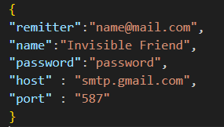

# AmigoInvisible
Programilla en Python3 para repartir amigos invisibles. Se enviará al correo de cada participante el amigo que les toque.

La restricción por grupos consiste en que los miembros de un mismo grupo no podrán ser amigos invisibles entre ellos mismos.
El código se puede mejorar y las pull requests son bienvenidas.
## Requisitos
Debes tener Python3 instalado en tu sistema y ejecutar el siguiente comando en consola:
```console
pip install random smtplib re email
```
Debes introducir en el archivo config.json las credenciales de acceso a tu cuenta de Gmail: correo y contraseña.




También debes activar una contraseña para la [aplicacion](https://support.google.com/accounts/answer/185833?hl=es) para que pueda enviar los correos.

## Funcionamiento
Accede a la carpeta donde se encuentre el proyecto y ejecuta el siguiente comando en la terminal o cmd:
```console
python3 main.py -f contactos.txt
```

El archivo de contactos.txt debe contener un destinatario en cada linea, de este modo:

nombre:correo@mail.com\
nombre2:correo2@mail.com
